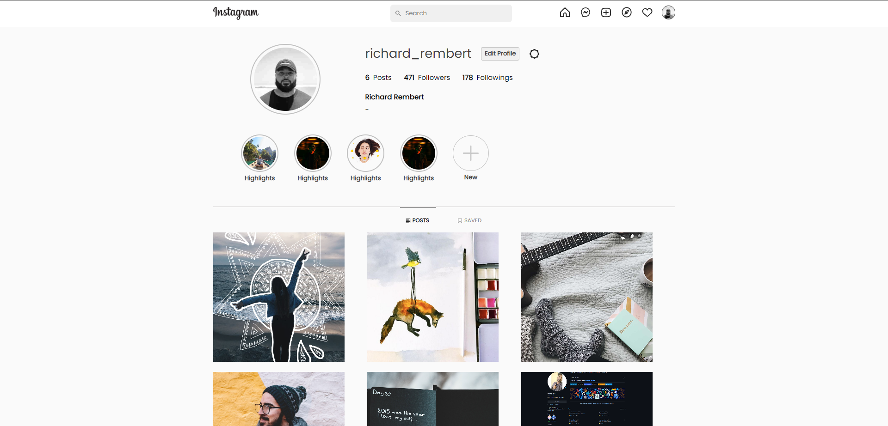

# Instagram-mern
This Instagram clone is made with React, Node, MongoDB .


## Prerequisites
Make sure you have installed all of the following prerequisites on your development machine:
* Git - [Download & Install Git](https://git-scm.com/downloads). OSX and Linux machines typically have this already installed.
* Node.js - [Download & Install Node.js](https://nodejs.org/en/download/) and the npm package manager. If you encounter any problems, you can also use this [GitHub Gist](https://gist.github.com/isaacs/579814) to install Node.js.

## Environment variables React setup 
```
REACT_APP_API_URL=http://localhost:8000
REACT_APP_GOOGLE_OAUTH_REDIRECT_URL=http://localhost:8000/auth/google/oauth
REACT_APP_GOOGLE_CLIENT_ID= {google auth client id}

```
## Environment variables Node setup 
```
PORT = {port number}
Mongo_URI= {your mongo uri}
JWT_Secret= {jwt secret}
JWT_Refresh_Secret= {jwt refresh secret}
CLIENT_URL=http://localhost:3000
email=userzyx01@xyz.com
password=1skjsnksdsd
clientid={google auth cclientid}
clientsecret={google auth client secret}
redirect_url=http://localhost:8000/auth/google/oauth

```


## Cloning The GitHub Repository
The recommended way to get ChatGPT clone is to use git to directly clone the repository:

```bash
$ git clone https://github.com/nisabmohd/Instagram-mern.git
```

## Running Your Application

open terminal/bash in this repo and enter below commands to start the application

&#8594; To start the server
```bash
$ cd frontend
$ node server.js
```

&#8594; To start the client app
```bash
$ cd client
$ npm start
```


* Your client application should run on port 3000 with the *development* environment configuration, so in your browser just go to [http://localhost:3000](http://localhost:3000)

* Your server application should run on port 8000, so in your browser just go to [http://localhost:8000](http://localhost:3000)

<br>



